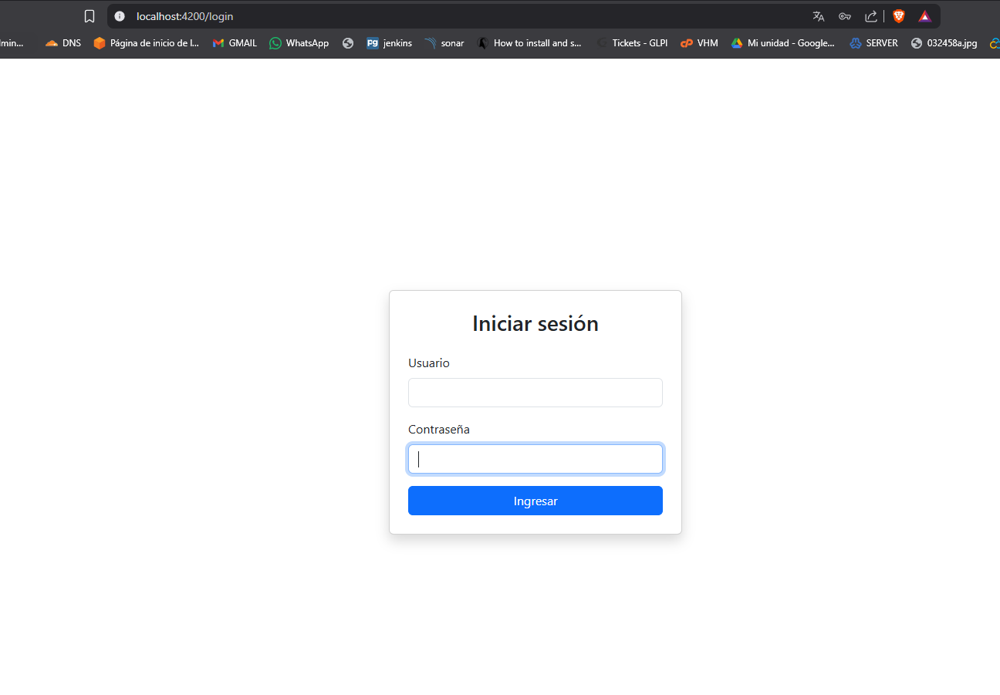
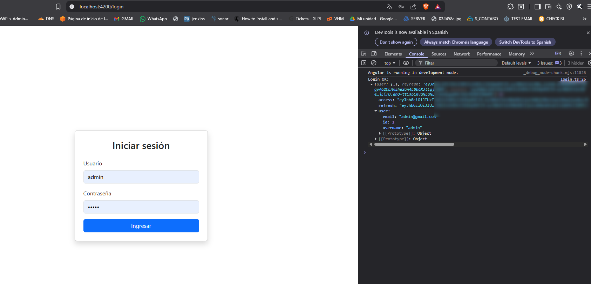

# HU35.T3 - Crear vista login

## Objetivo
Crear una vista de inicio de sesión en Angular que permita ingresar usuario y contraseña, enviar las credenciales al backend y validar la respuesta del endpoint de login.

---

## Ruta frontend

GET /login

---

## Endpoint consumido

POST /api/auth/login/

---

## Funcionalidad implementada

- Creación del componente de login.
- Formulario con campos usuario y contraseña.
- Conexión con el backend mediante `HttpClient`.
- Envío de credenciales al endpoint de login.
- Validación de respuesta con tokens JWT en consola.
- Configuración de CORS en backend para permitir conexión desde Angular.

---

## Pruebas realizadas

- Carga correcta de la vista login.
- Login con credenciales válidas.
- Recepción de `access`, `refresh` y datos del usuario.
- Corrección de error CORS entre Angular y Django.

---

## Evidencia

---

## Resultado

Se creó correctamente la vista de login en Angular y se validó la conexión con el backend. El formulario envía credenciales al endpoint `/api/auth/login/` y recibe tokens JWT, quedando listo para implementar el servicio de autenticación.