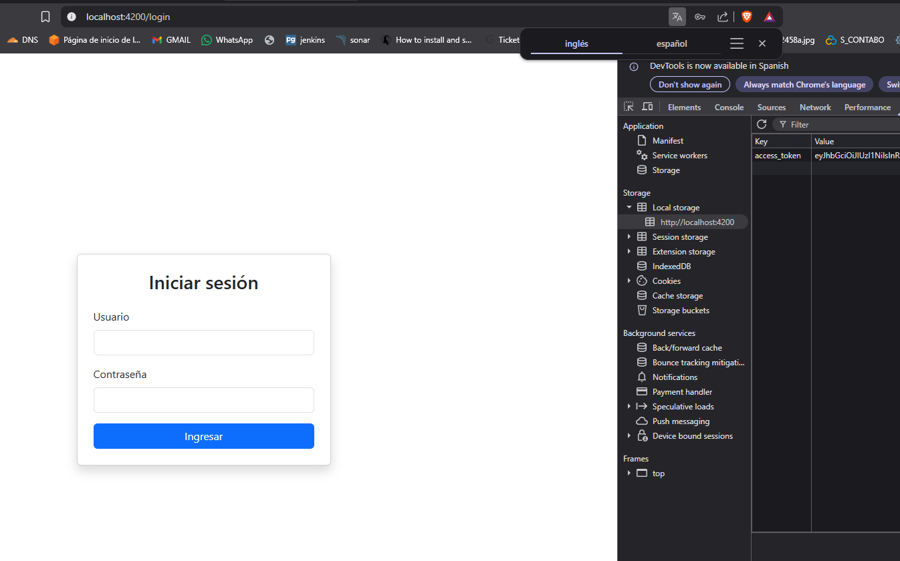
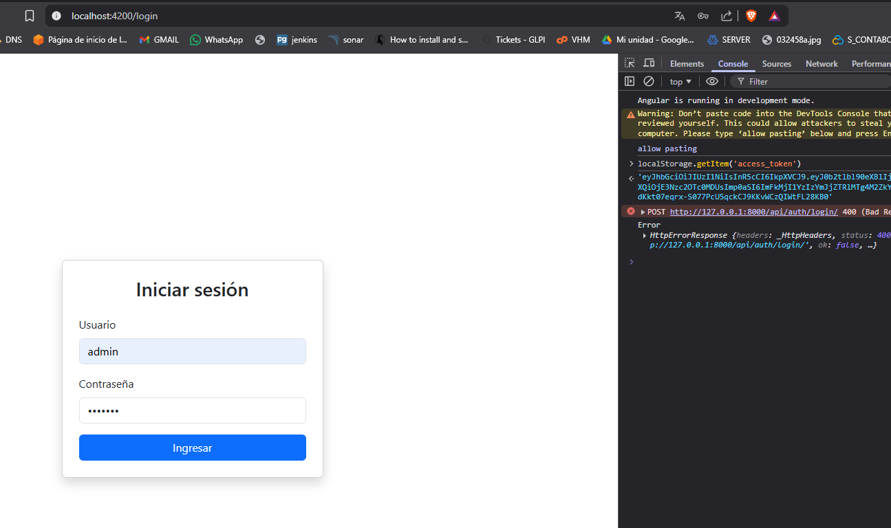

# HU35.T4 - Implementar AuthService

## Objetivo
Implementar un servicio de autenticación en Angular que permita centralizar la comunicación con el backend, así como gestionar el almacenamiento y recuperación del token JWT.

---

## Funcionalidad implementada

- Creación del servicio `AuthService`.
- Implementación del método `login()` para consumir el endpoint de autenticación.
- Almacenamiento del token JWT en `localStorage`.
- Métodos para obtener y eliminar el token (`getToken`, `logout`).
- Integración del servicio con el componente de login.

---

## Endpoint consumido

POST /api/auth/login/

---

## Flujo de funcionamiento

1. El usuario ingresa sus credenciales en la vista de login.
2. El componente llama al método `login()` del AuthService.
3. El servicio envía las credenciales al backend.
4. El backend responde con tokens JWT.
5. El token `access` es almacenado en `localStorage`.
6. El token queda disponible para futuras peticiones.

---

## Pruebas realizadas

- Login exitoso → token guardado correctamente.
- Persistencia del token luego de recargar la página.
- Login fallido → manejo de error en consola.

---

## Evidencia

---

## Resultado

Se implementó correctamente el servicio de autenticación en Angular, permitiendo centralizar la lógica de login y gestionar el almacenamiento del token JWT. El sistema queda preparado para el uso de interceptores y protección de rutas.