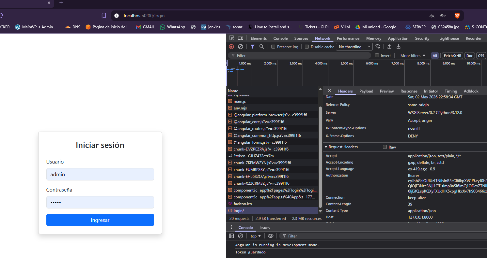
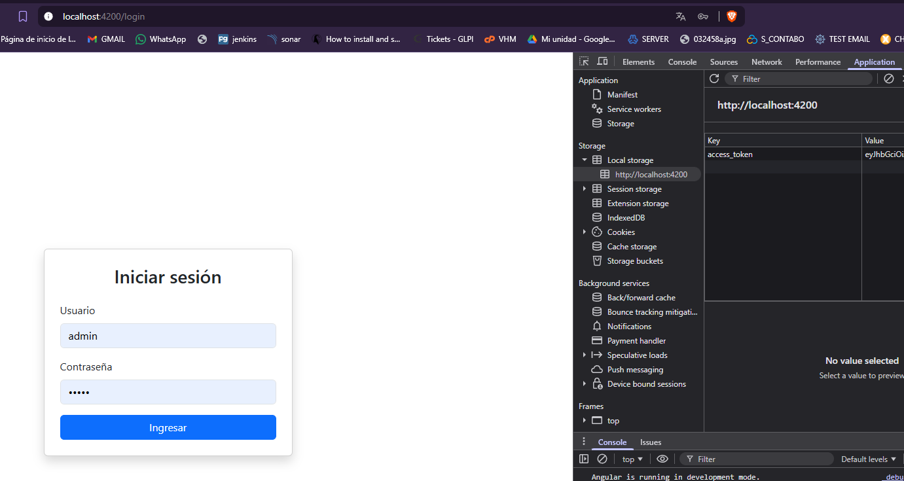

# HU35.T5 - Interceptor JWT

## Objetivo
Implementar un interceptor en Angular que agregue automáticamente el token JWT a cada petición HTTP para autenticar al usuario en el backend.

---

## Funcionalidad implementada

- Creación de interceptor `authInterceptor`.
- Obtención del token desde `AuthService`.
- Clonado de requests HTTP.
- Adición automática del header `Authorization: Bearer TOKEN`.
- Registro del interceptor en la configuración global de Angular.

---

## Flujo de funcionamiento

1. El usuario inicia sesión.
2. El token JWT se guarda en `localStorage`.
3. Cada request HTTP pasa por el interceptor.
4. El interceptor agrega el header `Authorization`.
5. El backend recibe el token y valida acceso.

---

## Pruebas realizadas

- Token presente en `localStorage` luego de login.
- Verificación del header `Authorization` en requests (Network).
- (Opcional) Acceso a endpoint protegido con token válido.

---

## Evidencia

---

## Resultado

Se implementó correctamente un interceptor JWT que agrega automáticamente el token en cada petición HTTP, permitiendo autenticación transparente con el backend.