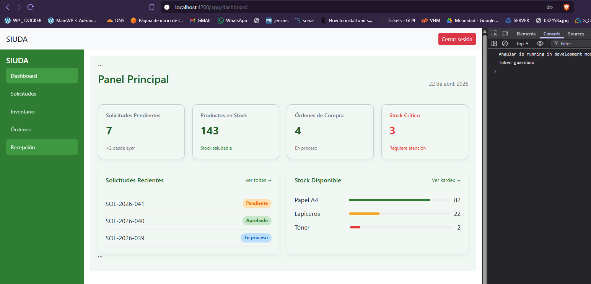

# HU35.T8 - Pruebas completas del flujo de autenticación

## Objetivo
Validar el flujo completo de autenticación del sistema, verificando login, almacenamiento de token, rutas protegidas, manejo de errores y cierre de sesión.

---

## Flujo probado

1. El usuario ingresa credenciales en la vista login.
2. Angular envía credenciales al backend mediante AuthService.
3. El backend valida credenciales y retorna tokens JWT.
4. El token `access` se almacena en `localStorage`.
5. El interceptor agrega automáticamente el token en las peticiones HTTP.
6. El guard permite o bloquea acceso a rutas protegidas.
7. El usuario puede cerrar sesión eliminando el token.

---

## Pruebas realizadas

### 1. Login exitoso
Resultado esperado:
- Backend responde correctamente.
- Token almacenado.
- Redirección a `/app/dashboard`.

Evidencia:

---

### 2. Login fallido
Resultado esperado:
- Se muestra mensaje `Credenciales inválidas`.

Evidencia:

---

### 3. Token almacenado
Resultado esperado:
- `access_token` presente en `localStorage`.

Evidencia:

---

### 4. Ruta protegida sin token
Resultado esperado:
- Al intentar ingresar a `/app/dashboard` sin token, el sistema redirige a `/login`.

Evidencia:

---

### 5. Logout
Resultado esperado:
- El token se elimina.
- El usuario vuelve a `/login`.

Evidencia:

---

## Resultado
Se validó correctamente el flujo completo de autenticación del sistema. El login, almacenamiento de token, interceptor, guard, manejo de errores y logout funcionan de manera integrada entre frontend y backend.